# Deep Taylor Decomposition

### This implementation codes are specifically designed to see the visual result of deep taylor decomposition, a novel saliency mapping methods for deep neural network, applied at ImageNet pretrained models such as vgg or resnet.

**Abstract** - Nonlinear methods such as Deep Neural Networks (DNNs) are the gold standard for various challenging machine learning problems, e.g., image classification, natural language processing or human action recognition. Although these methods perform impressively well, they have a significant disadvantage, the lack of transparency, limiting the interpretability of the solution and thus the scope of application in practice. Especially DNNs act as black boxes due to their multilayer nonlinear structure. In this paper we introduce a novel methodology for interpreting generic multilayer neural networks by decomposing the network classification decision into contributions of its input elements. Although our focus is on image classification, the method is applicable to a broad set of input data, learning tasks and network architectures. Our method is based on deep Taylor decomposition and efficiently utilizes the structure of the network by backpropagating the explanations from the output to the input layer. We evaluate the proposed method empirically on the MNIST and ILSVRC data sets. - https://arxiv.org/abs/1512.02479

## Results

### vgg16bn-ImageNet pretrained

| 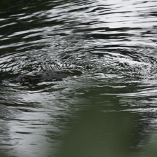 | 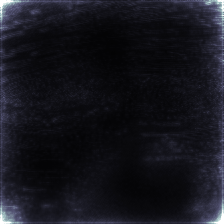 | 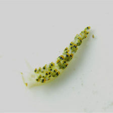 | 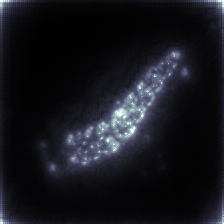 | 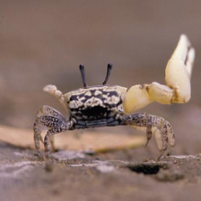 | 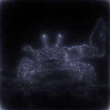 |
| :----------------------------------------------------------: | ------------------------------------------------------------ | ------------------------------------------------------------ | ------------------------------------------------------------ | ------------------------------------------------------------ | ------------------------------------------------------------ |
| 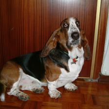 | 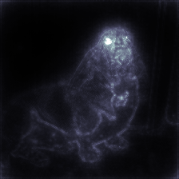 | 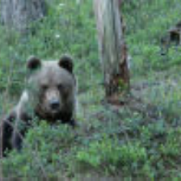 | 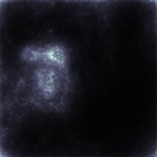 | 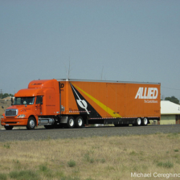 | 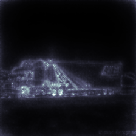 |

### vgg19-ImageNet pretrained

|  | 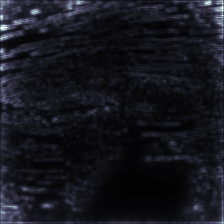 |  | 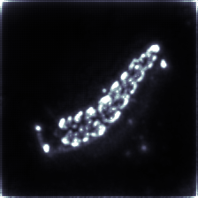 |  | 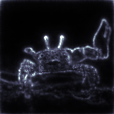 |
| ------------------------------------------------------------ | ------------------------------------------------------------ | :----------------------------------------------------------: | ------------------------------------------------------------ | ------------------------------------------------------------ | ------------------------------------------------------------ |
|  |  |  | 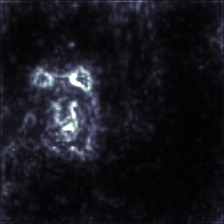 |  | 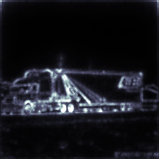 |

### resnet34-ImageNet pretrained

|  | 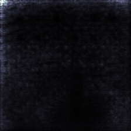 |  | 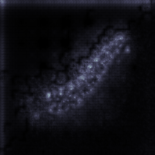 |  | 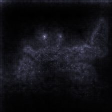 |
| :----------------------------------------------------------: | ------------------------------------------------------------ | ------------------------------------------------------------ | ------------------------------------------------------------ | ------------------------------------------------------------ | ------------------------------------------------------------ |
|  |  |  | 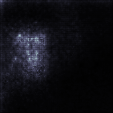 |  | 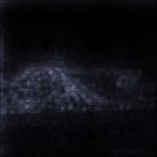 |

### resnet101-ImageNet pretrained

|  | 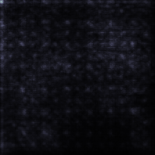 |  | 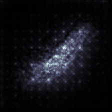 |  | 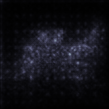 |
| :----------------------------------------------------------: | ------------------------------------------------------------ | ------------------------------------------------------------ | ------------------------------------------------------------ | ------------------------------------------------------------ | ------------------------------------------------------------ |
|  | 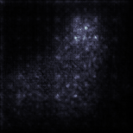 |  | 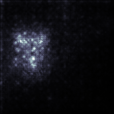 |  | 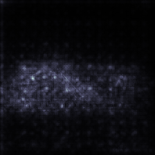 |

## Future Work

* Densenet pretrained model version will be updated soon.
* Batch normalization layer need some modification.
